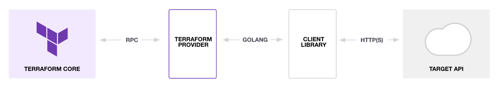
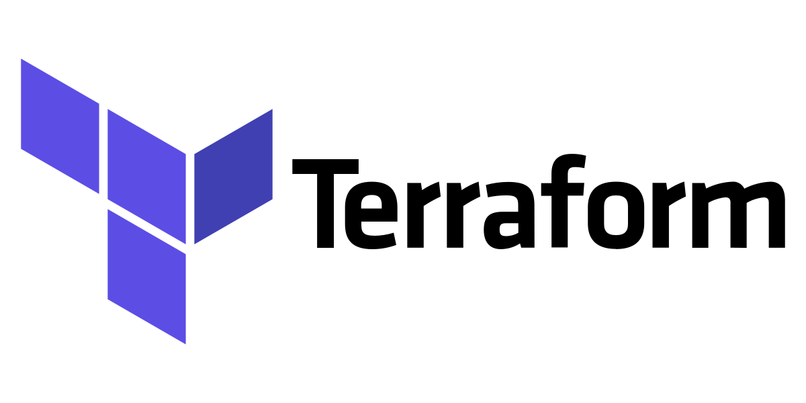

% Terraform Basics
% Sergey Korobitsin
% Сентябрь 2022

## О докладчике


- Руковожу инфраструктурой в Smart Cities
- Строю с коллегами Aitu.Cloud
- Живу с Terraform с 2018 
- Начал с версии 0.11, сейчас 1.0.7
- Написал ~10k SLOC на HCL (в основном модули)

## What "IS" Terraform

> HashiCorp Terraform is an infrastructure as code tool 
> that lets you define both cloud and on-prem resources 
> in human-readable configuration files that you can version, reuse, and share. 

- Один бинарник на Go
- Реализация Infrastructure as a Code
- Декларативное описание конфигурации\*
- CRUD-friendly

## What Terraform "IS NOT"

- НЕ инструмент SCM (Software Configuration Management)
- НЕ "One Tool to Automate Them All"
- НЕ серебряная пуля

## Core Concepts



## Core Concepts: Terraform Core

- Управление провайдерами:
  - Версии
  - Загрузка и установка в рабочий каталог
- Управление жизненным циклом объектов:
  - Ресурсы и источники данных (datasource)
  - Модули
  - **Управление зависимостями**
- DSL: Domain Specific Language
- Работа с Terraform State

## Core Concepts: Providers

```ruby

terraform {
  required_providers {
    openstack = {
      source = "terraform-provider-openstack/openstack"
      version = "1.48.0"
    }
  }
}

provider "openstack" {
  alias       = "shiny-new"
  auth_url    = "https://keystone.qshy.aitu.cloud:5000/v3/"
  tenant_name = "miskatonic"
}
```

## Core Concepts: Providers (2)

- Тоже бинарники, написанные на Go и запускаемые самим Terraform
- Предоставляют набор ресурсов и datasource-ов в едином стиле
- Загружаются Terraform-ом из Terraform Registry\*
- Имеют параметры, определяющие, как минимум, доступ к тому, чем они управляют
- Часто параметры можно передать как Environmental Variables

## Core Concepts: Resources

```ruby
resource "openstack_compute_instance_v2" "vm_0" {
  name            = "exampleproject_dev_vm_0"
  flavor_name     = "b1.xsmall"
  # [ ... ]
}
```

- Любой объект, который может быть создан, прочитан, изменен и удалён (CRUD)
- Ресурс: определяется *типом* и уникальным *именем* в рамках *модуля*, имеет *аргументы* и *атрибуты*
- Атрибуты одних ресурсов можно использовать как аргументы других

## Core Concepts: Datasources

```ruby
data "openstack_images_image_v2" "almalinux8" {
  name        = "AlmaLinux-8-GenericCloud-8.6-20220718.x86_64"
  most_recent = true
}
```

- Только `R` из `CRUD` - получение данных для использования далее
- Для объектов, которыми мы не управляем (потому что не можем, или потому, что не хотим)
- Обычно состав ресурсов и datasource-ов провайдера совпадает, но не всегда

## Core Concepts: State

```json
{
  "terraform_version": "1.0.7",
  "serial": 46,
  "outputs": {},
  "resources": []
}
```

- Объект JSON, хранит всю информацию о ресурсах, datasource-ах, провайдерах и т.п.
- Можно хранить локально в виде файла, в БД, где угодно (определяется State Backend)
- Утеря state - плохо
- Может содержать чувствительную информацию (например, пароли)

## Core Concepts: Модули

```ruby
module "networking" {
  source = "./networking"
  create_public_ip = true
}
```

- Модуль - каталог с файлами `*.tf`
- Весь код организован в виде модулей (`root module`)
- Имеют входные, выходные и локальные переменные
- Нужны для переиспользования и логического деления кода

## Flow

{ height=50% }

- Локально: "в одно лицо", эксперименты
- GitOps - для работы в команде
- Может быть встроена в другие утилиты (`vmbar`)

## Flow: init

```bash
$ terraform init
```

- Проверка синтаксиса (`terraform validate`)
- Инициализация модулей
- Инициализация бэкенда
- Загрузка провайдеров

## Flow: plan

```bash
$ terraform plan
module.miskatonic.openstack_networking_quota_v2.quota: Refreshing state... [id=someID]
  # module.cicdlab.null_resource.default_network will be created
  + resource "null_resource" "default_network" {
      + id       = (known after apply)
      + triggers = {
          + "project_id" = "someID"
        }
    }
```

- Обновлен статус ресурсов (`terraform refresh`)
- Показаны изменения и действия, которые будет делать Terraform
- Можно сохранить в виде файла

## Flow: apply

```bash
$ terraform apply
module.cicdlab.null_resource.default_network: Creation complete after 0s [id=someID]
Apply complete! Resources: 10 added, 0 changed, 0 destroyed.
```

## Flow: destroy (extra)

```bash
$ terraform destroy
```

## Language: Syntax

```
<BLOCK TYPE> [<BLOCK PARAMETER1> <BLOCK PARAMETER2> ...] {
  <ARGUMENT NAME1> = <ARGUMENT VALUE1>
  <ARGUMENT NAME2> = <ARGUMENT VALUE2>
  ....
  <INNER BLOCK> {
      <ARGUMENT NAME1> = <ARGUMENT VALUE1>
      <ARGUMENT NAME2> = <ARGUMENT VALUE2>
  }
}
```

- Можно и JSON

## Language: Input Variables and Outputs

```ruby
variable "myfile_content" {
  type        = string
  description = "Content of myfile.txt for test"
  default     = "Hello from Terraform."
  # sensitive   = true
  # can be set as TF_VAR_myfile_content env variable
}

locals {
  a = 1
}

output "myfile_id" {
  value = local_file.myfile.id
}
```

## Language: Types, Values, Functions, Conditionals

- Простые: `string "hey"`, `bool true`, `number 123`
- Коллекции: `list` `[a, b]`, `map` `{ a = 1, b =2}`
- `null`
- `function(arg1, arg2)`
- `condition ? if_true : if_false`

## Resource Meta-Arguments

```ruby
resource "aws_iam_user" "the-accounts" {
  provider = aws.europe
  for_each = toset( ["Todd", "James", "Alice", "Dottie"] )
  # Can be used for modules too
  # count
  name     = each.key
  # lifecycle
}
```

## Demo и вопросы

<https://github.com/aitucloud/terraform-cloud-management>

## Спасибо!


